# Codebasics Resume Project Challenge #13

## Table of Contents
- [Objective](#objective)
- [Key Metrics](#key-metrics)
- [Tools](#tools)
- [Data Model](#data-model)
- [Key Insights and Recommendations](#key-insights-and-recommendations)
- [Reflections](#reflections)
- [Dashboard Screenshots](#dashboard-screenshots)
- [Links](#links)

## Objective
**Objective: Assess the company's performance across key metrics to boost trip volume and improve passenger satisfaction.**

## Key Metrics

- Trip Volume
- Passenger Satisfaction
- Repeat Passenger Rate
- Trip Distribution
- Balance between New and Repeat Passengers

## Tools

- PowerBI: Create interactive, self-explanatory dashboard to get insights through visualizations.
- SQL: Craft sql-queries to get table reports and answer business questions.

## Data Model

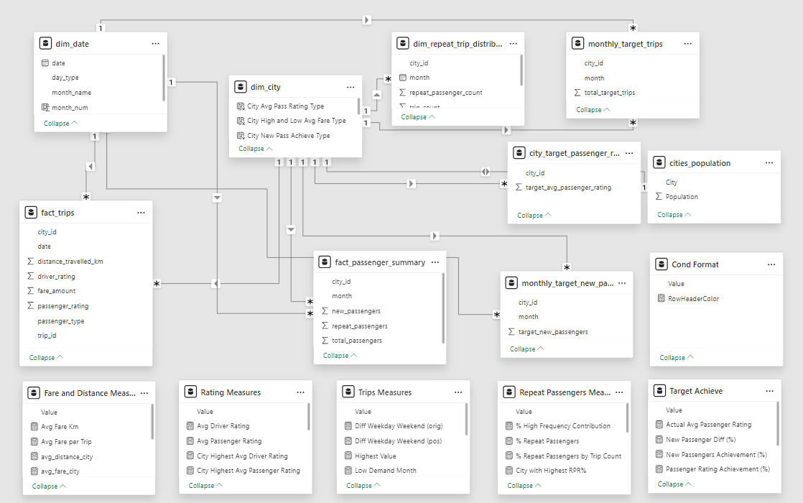

## Key Insights and Recommendations

### **1. Trip Volume & Distribution 📊**
- 🔹 **Cities Insights**: Jaipur, Lucknow, and Surat lead in trip volume, while Mysore, Coimbatore, and Visakhapatnam lag.  
- 🔹 **Months Insights**: All cities show higher trip demand in February and March, with low demand in June.  
- 💡 **Recommendation**: Boost marketing efforts in low-performing cities and off-peak months with targeted campaigns and discounts.  

---

### **2. Passenger Satisfaction & Ratings ⭐**
- 🔹 **Insight**: Mysore and Kochi have the highest passenger and driver ratings, while Surat, Lucknow, and Vadodara show lower satisfaction levels. New passengers give higher ratings compared to repeat passengers.  
- 💡 **Recommendation**: Improve service quality in low-rated cities through driver training, vehicle upkeep, and personalized customer interactions.  

---

### **3. Repeat Passenger Rate (RPR) 🔄**
- 🔹 **Cities Insights**: Surat (43%) and Lucknow (37%) excel in RPR, while Jaipur (17%) and Mysore (11%) struggle.  
- 🔹 **Months Insights**: RPR peaks in May-June due to seasonal demand and declines in January.  
- 💡 **Recommendation**: Launch loyalty programs and referral bonuses in low RPR cities to encourage retention.  

---

### **4. Pricing & Distance Optimization 💸**
- 🔹 **Insight**: Jaipur has the highest fare per trip (₹484) due to longer trip distances and high fare per km, while Surat offers the lowest (₹117).  
- 💡 **Recommendation**: Reassess fare strategies to balance affordability and profitability, especially in tourism-focused cities to increase RPR.  

---

### **5. Operational Targets 🎯**
- 🔹 **Tourism-focused cities:** Tend to exceed their targets in trip volume and average passenger rating (e.g., Mysore and Jaipur).  
- 🔹 **Business-focused cities:** Excel in attracting new passengers (e.g., Coimbatore and Surat).  
- 🔹 **Mixed-use cities:** Consistently meet targets across all metrics (e.g., Chandigarh and Surat).  
- 💡 **Recommendation**: Strengthen new passenger retention in tourism cities, enhance trip volume in business cities, and sustain balanced efforts across metrics in mixed-use cities.  

---

### **6. Emerging Mobility Trends 🌱**
- 🔹 **Insight**: Electric vehicles (EVs) and sustainability are gaining traction, especially in cities with high trip distances like Jaipur.  
- 💡 **Recommendation**: Deploy EVs strategically to reduce costs and attract eco-conscious passengers. Partner with local businesses for EV charging infrastructure.  

## Reflections

- 🛠️ Improved skills in SQL, PowerBI.  
- 📊 Gained hands-on experience in data analysis and storytelling.  
- 🌍 Developed a deeper understanding of ride-hailing operations, optimizing trip volume, pricing strategies.
- 🚀 Applied technical knowledge to solve real-world data problems.  

## Dashboard Screenshots

### Main Page

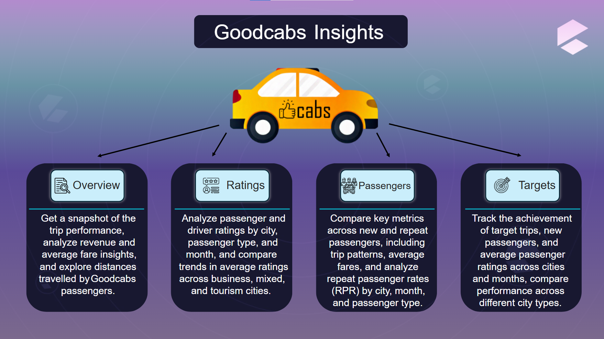

### Overview Page

**Trips Analysis**

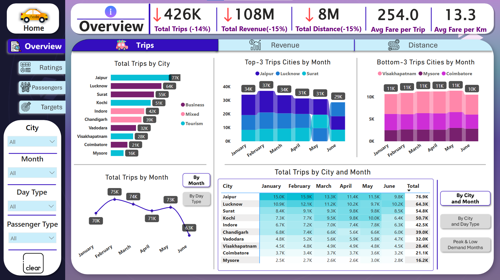

---

**Revenue Analysis**

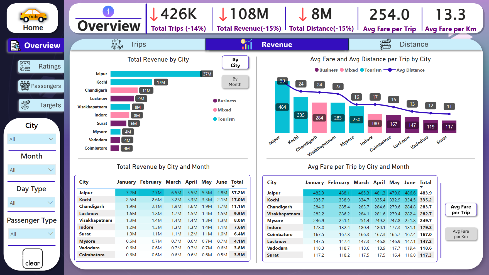

---

**Distance Analysis**

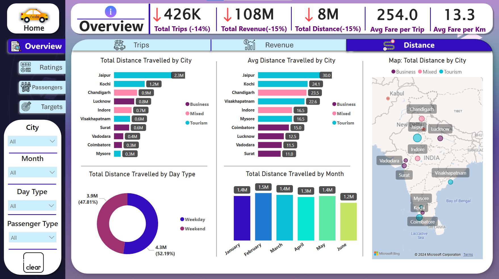

### Ratings Page

**Passenger Rating**

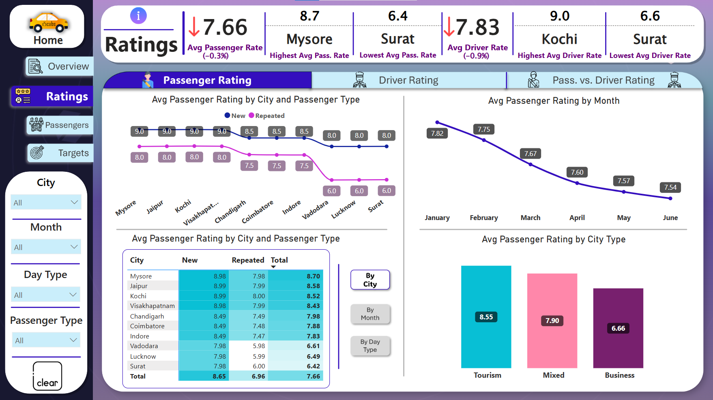

---

**Driver Rating**

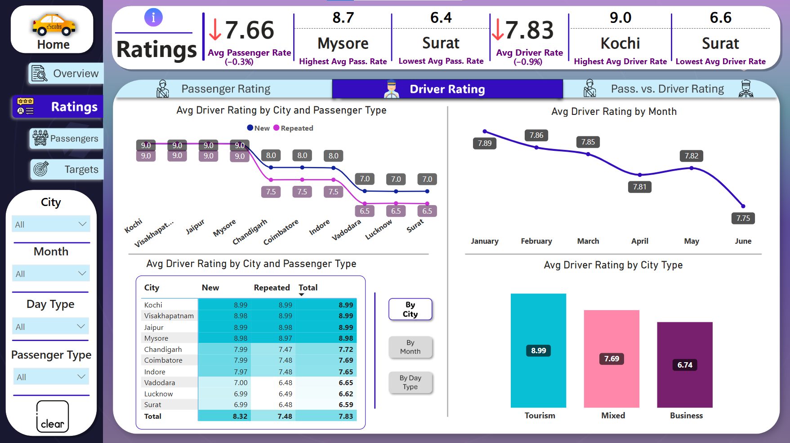

---

**Passenger vs. Driver Rating**

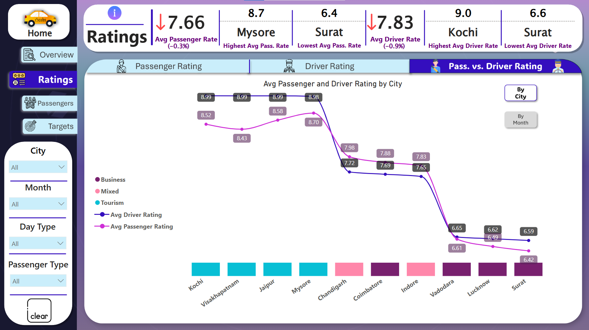

### Passengers Page

**Repeat vs. New Passengers**

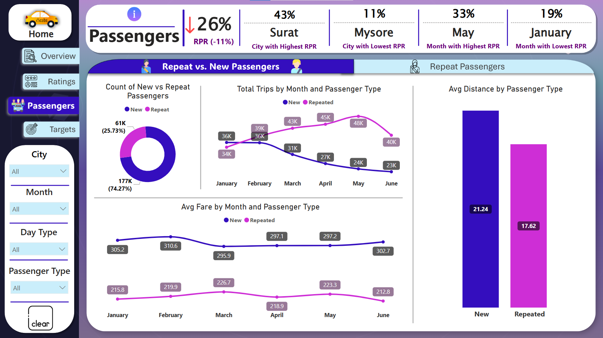

---

**Repeat Passengers**

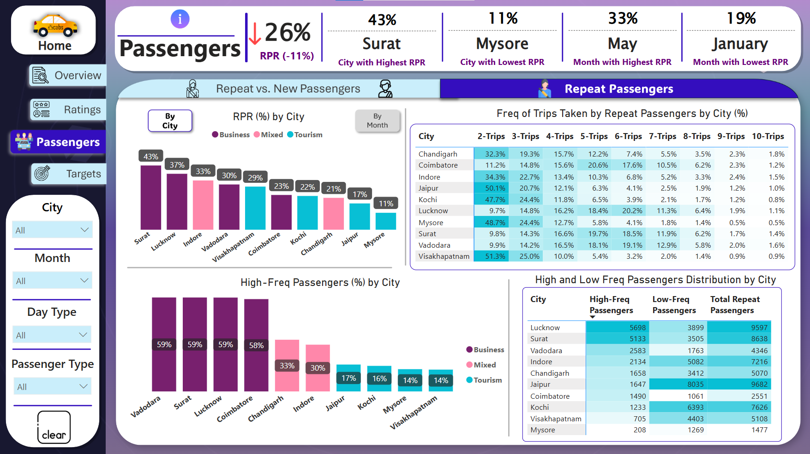

### Targets Page

**Target Trips**

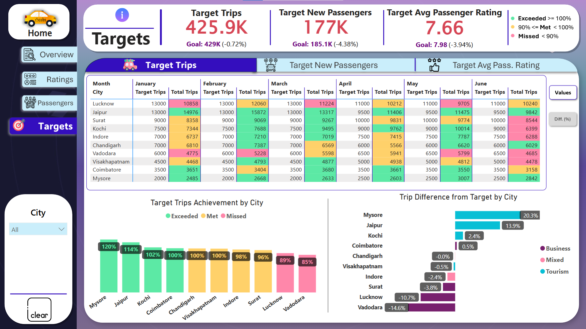

---

**Target New Passengers**

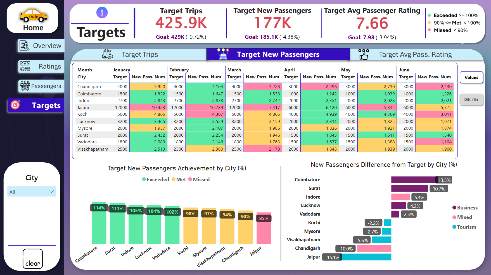

---

**Target Avg Passenger Rating**

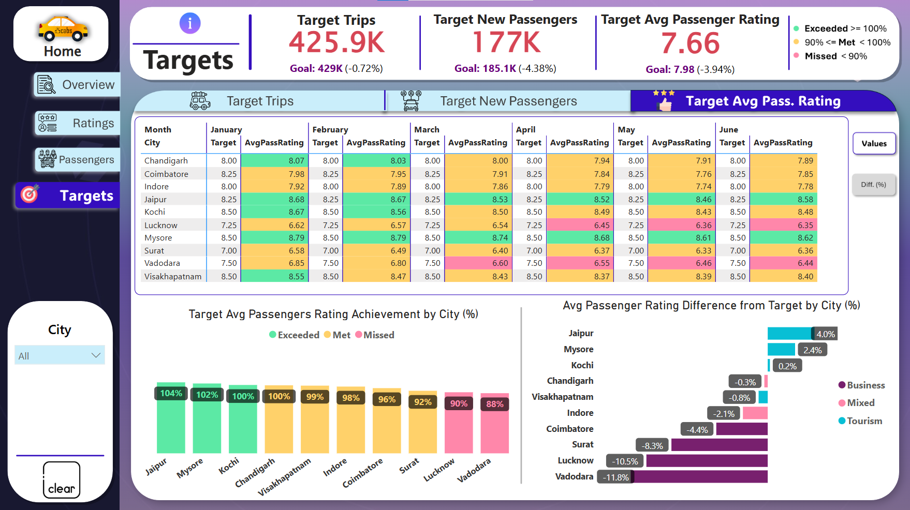

## Links

**Live Dashboard Link:** [Dashboard](https://app.powerbi.com/view?r=eyJrIjoiODQ0YzEwNzgtNmJkYy00YmYyLWIyNDUtOGQ2MDk1ZDEyZDk2IiwidCI6ImI2OTBkMDhlLWY5OTctNDFhNi1hMzhiLWM3MzJhZjA5OTkzYiIsImMiOjh9)

**Video Presentation Link:** [Video Presentation](https://youtu.be/iNzZYb9-qSE)